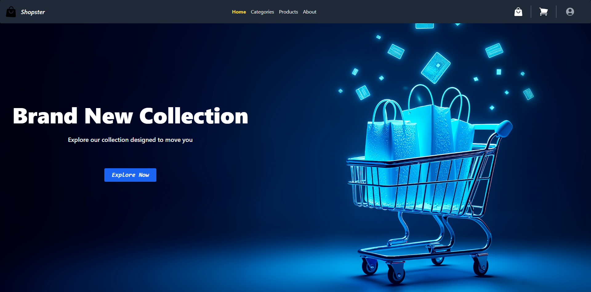
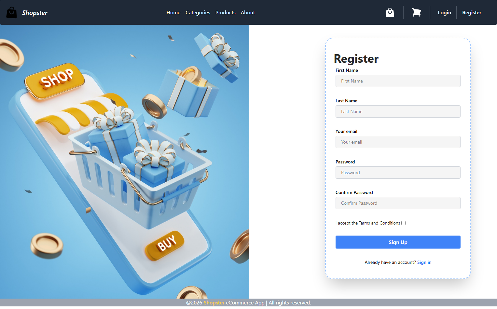
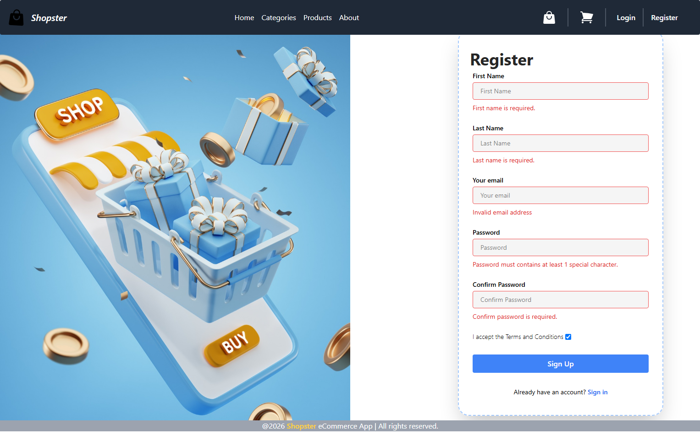
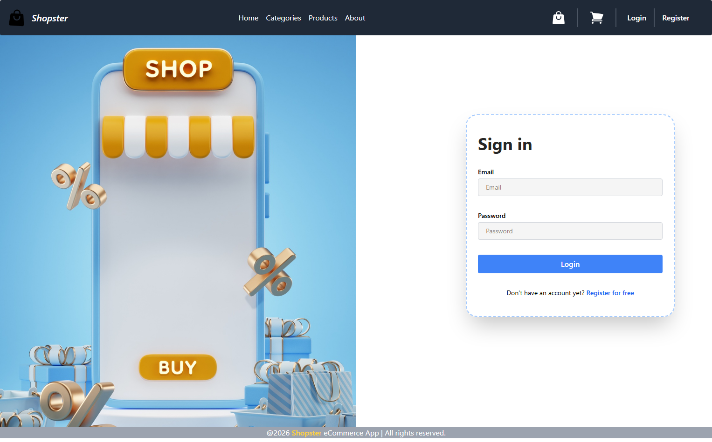
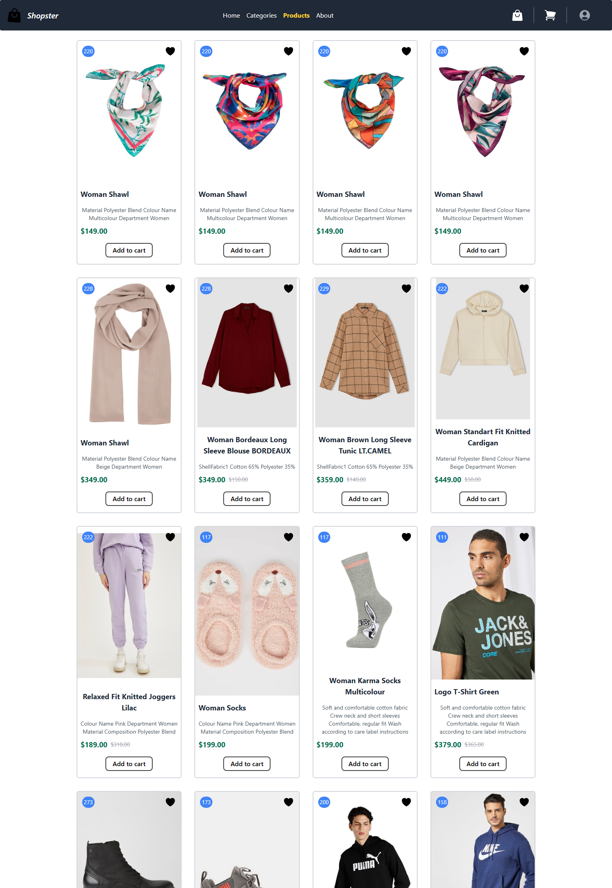
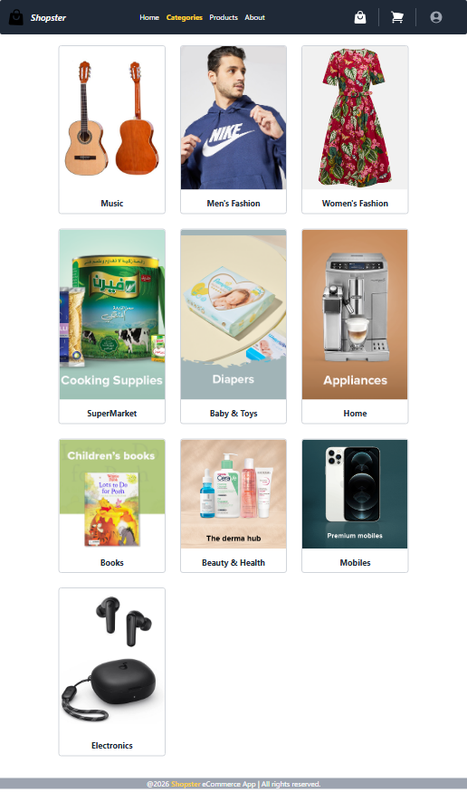
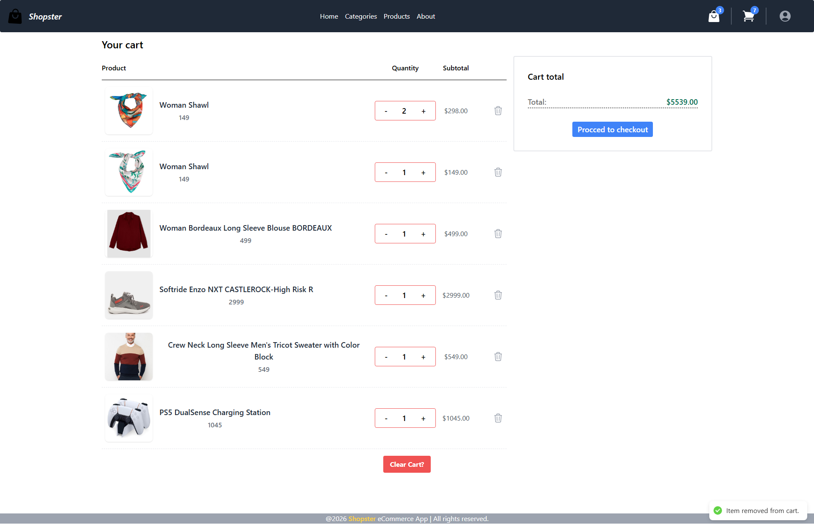
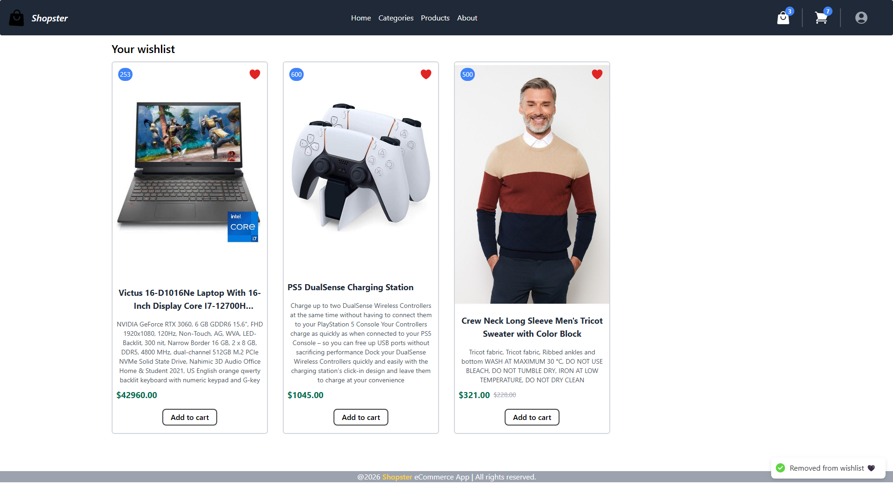

# 🛒 E-Commerce Platform (React 19 & TypeScript)

A high-performance, responsive e-commerce web application built with **React 19**, **TypeScript**, **Vite**, and **Tailwind CSS**. Designed with a focus on modern UX patterns, optimistic UI updates, resilient API synchronization, and scalable architecture using **Redux Toolkit**.

---

## 🌐 Live Demo & Preview

- **Live Application:** [shopster-weld.vercel.app](shopster-weld.vercel.app)
- **API Documentation:** Integrated with RouteMisr v2 E-Commerce API.

---

## ✨ Key Features

- 🔐 **Authentication & Session Management:** JWT-based user authentication, persistent sessions, login/register validation, and protected routes.
- ⚡ **Optimistic Cart Updates:** Direct state mutation and single-pass API payload sync for seamless quantity adjustments without redundant server polling.
- 🎯 **Interactive Product Wishlist:** Quick-toggle wishlist with real-time UI indicators and notification toasts.
- 🎨 **Adaptive Navigation:** Dynamic sticky header featuring scroll-based glassmorphism, route detection, and responsive profile dropdown.
- 📱 **Fully Responsive UI:** Crafted with Tailwind CSS and Flowbite React for unified design across Mobile, Tablet, and Desktop displays.
- 🔔 **Contextual Feedback Systems:** Toast notification stack using `react-hot-toast` combined with localized loading indicators on interactive elements.

---

## 🛠️ Tech Stack & Architecture

- **Core Framework:** React 19, TypeScript
- **Build Tool:** Vite
- **State Management:** Redux Toolkit (RTK), Redux Persist
- **Styling & UI Components:** Tailwind CSS, Flowbite React, Heroicons
- **Form Handling & Validation:** React Hook Form, Zod
- **Routing:** React Router v6
- **HTTP Client:** Axios (Interceptors, Centralized Error Handling)
- **Feedback & Notifications:** React Hot Toast

---

## 📐 Technical Architecture & Trade-offs

### 1. State Management & API Sync Strategy

- **Single-Pass Cart Sync:** Utilizing RouteMisr v2 endpoints (`POST /cart` & `PUT /cart/{id}`) which return the full updated cart payload. This completely eliminates redundant `GET` re-fetching calls after cart modifications.
- **Component Self-Containment:** Feature-specific components (e.g., `ProfileDropdown`, `CartIcon`) access Redux state directly via custom typed selectors (`useAppSelector`) rather than accepting prop-drilled data, preventing unnecessary parent re-renders.

### 2. Isolated Async State & User Feedback

- **Local In-Place Loaders:** Managed button-level loading states (`disabled` + micro-spinners) during async thunks (like wishlist toggles) to prevent rapid multi-click submissions.
- **Declarative Toasts with `toast.promise`:** Unified notification abstraction via `handleAsyncToast` utility to decouple UI logic from async success/failure notification management.

---

## 🔒 Security & Data Integrity

- **Strict Schema Validation:** Client-side validation powered by **Zod** ensures password strength compliance (special character checks) and password-confirmation matching prior to payload dispatch.
- **Real-Time Email Availability Verification:** Debounced async check triggered on email input change to provide instant user feedback on email availability prior to form submission, reducing registration friction.
- **Axios Authorization Interceptors:** Automatic injection of JWT Bearer tokens in request headers for protected endpoints with localized error handling on token expiration.
- **Route Guard Protection:** Unauthenticated users attempting protected actions (Checkout, Profile Management) are seamlessly redirected or prompted via auth modal dialogs.

---

## 📸 Application Screenshots & Key Workflows

### 1. Home & Product Showcase

> Interactive storefront with dynamic hero sections, responsive route-highlighting navbar, product grids, and quick-action wishlist/cart toggles.

  

**Key Features:**

- Dynamic sticky header with scroll-based blur transition.
- Direct product wishlist toggling with instant visual state sync.

---

### 2. User Authentication & Onboarding

> Clean two-column registration and login flow powered by **React Hook Form** and **Zod** schema validation. Captures user details and credentials seamlessly.

  
  

**Key Features:**

- Asynchronous real-time email availability verification on (onBlur) event.
- Strict schema validation for special character password requirements and match checking.
- Visual cover layout optimized with `object-cover object-top` for desktop displays.

---

### 3. User Login & Authentication

> Streamlined login interface with JWT authentication management, persistent user sessions, and protected route access.

  

**Key Features:**

- Real-time form state management and error feedback via `react-hot-toast`.
- Persistent session storage integration via Redux Toolkit & Axios interceptors.

---

### 4. Product Catalog

> Comprehensive product catalog featuring real-time pagination, category filters, and interactive search capability.

  

**Key Features:**

- Isolated product cards with dedicated loading states for wishlist and cart interactions.
- Responsive grid layout adapting seamlessly across mobile, tablet, and desktop viewports.

---

### 5. Category Navigation & Showcase

> Visual category grid allowing users to explore curated product listings filtered by specific categories.

  

**Key Features:**

- Smooth transition and navigation logic passing category parameters directly to API fetch operations.
- Optimized image rendering with Skeleton loaders during async data requests.

---

### 6. Cart Management & Quantity Synchronization

> Real-time interactive cart interface managing item quantities, price calculations, and item removals cleanly (from store, and database).

  

**Key Features:**

- Single-pass API payload synchronization with RouteMisr v2.
- Localized in-place loading spinners on individual product quantity controls.

---

### 7. User Wishlist

> Dedicated page allowing users to organize saved products and quickly transition them to the cart.

  

**Key Features:**

- Instant item removal and direct "Move to Cart" triggers.
- Real-time badge counter updates linked via Redux selectors.
